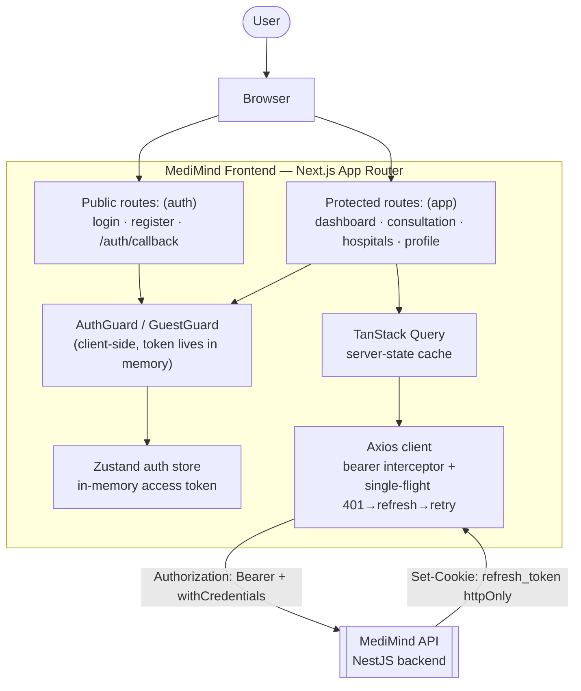
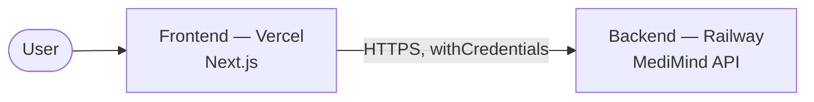

<p align="center">
  
  
  
  
  
  
</p>

<h1 align="center">MediMind — Frontend</h1>
<p align="center"><b>The web client for MediMind, a context-aware healthcare personal assistant.</b></p>

---

## Table of Contents

- [Table of Contents](#table-of-contents)
- [1. Overview](#1-overview)
- [2. Key Features](#2-key-features)
  - [Landing \& Auth](#landing--auth)
  - [Dashboard](#dashboard)
  - [AI Consultation](#ai-consultation)
  - [Hospitals](#hospitals)
  - [Profile](#profile)
  - [Platform / Engineering](#platform--engineering)
- [3. Tech Stack](#3-tech-stack)
- [4. Application Architecture](#4-application-architecture)
  - [Rendering model](#rendering-model)
- [5. Authentication Model](#5-authentication-model)
- [6. Project Structure](#6-project-structure)
- [7. Getting Started](#7-getting-started)
  - [Prerequisites](#prerequisites)
  - [Installation](#installation)
- [8. Environment Variables](#8-environment-variables)
- [9. Running the Project](#9-running-the-project)
- [10. Pages \& Routes](#10-pages--routes)
- [11. Backend Contract](#11-backend-contract)
- [12. Testing](#12-testing)
- [13. Deployment](#13-deployment)
- [14. Related Repository](#14-related-repository)
- [15. License](#15-license)

---

## 1. Overview

This is the **web client** for **MediMind** — a context-aware healthcare personal assistant built for Nigerian users, developed as a final-year Electrical and Electronics Engineering project at the **University of Lagos**. It is a [Next.js 16](https://nextjs.org/) (App Router) single-page application that consumes the [MediMind NestJS API](https://github.com/Femi-ID/medimind-API) to give users a longitudinal view of their vitals, an AI-guided symptom consultation grounded in that history, and a path to the nearest appropriate hospital when it matters.

The frontend is **not** where any clinical logic lives — emergency detection, severity assessment, and output safety-checking all happen backend-side. This app's job is to present that safely, quickly, and legibly: render the right UI state off a single `triage` field, never let an emergency banner get missed, and keep the experience calm under a slow or cold-started backend.

<!-- | | |
|---|---|
| **Author** | Idowu Oluwafemi Paul (160408034) |
| **Supervisor** | Dr. K. A. Abdulsalam |
| **Department** | Electrical and Electronics Engineering, University of Lagos |
| **Backend** | [`github.com/Femi-ID/medimind-API`](https://github.com/Femi-ID/medimind-API) | -->

---

## 2. Key Features

### Landing & Auth
- Marketing landing page (hero, features, how-it-works, FAQ, disclaimer band).
- Email/password login and registration, with client-side Zod validation mirroring the backend's DTOs.
- Google OAuth sign-in via a full-page redirect, completed on a dedicated `/auth/callback` page.
- Route protection: public auth pages redirect an already-authenticated user away (`GuestGuard`); the app shell redirects an unauthenticated user to `/login` (`AuthGuard`).

### Dashboard
- Latest-reading cards for blood pressure, heart rate, glucose, and weight, with trend sparklines.
- A combined multi-range trend chart (24H / 7D / 30D / 90D) built with Recharts, including a dual-line blood-pressure view.
- Rule-based "observation" banner and an alerts/insights panel surfaced from the backend's vitals-insights endpoint.
- Quick actions into logging a vital, starting a consultation, or finding a hospital.
- A "Log Vital" dialog with per-parameter validated inputs (same numeric bounds as the backend DTOs).

### AI Consultation
- Session-based chat UI: a session list, a message thread, and a composer.
- A vitals-context strip showing exactly what data was available to the AI for the current session — nothing is presented as context the user can't see.
- UI state driven entirely off the backend's `triage` field (`EMERGENCY` / `URGENT` / `MODERATE` / `SELF_CARE`) via a single `TRIAGE_CONFIG` map, so the visual severity language is defined in one place.
- A distinct, high-contrast `EmergencyCard` for `isEmergency` responses.
- On-demand geolocation: never requested on page load — only when the user takes an action (e.g. sending a message, or the backend flagging urgency) that can make use of it, avoiding a surprise permission prompt.
- A non-dismissible disclaimer rendered with every AI response.
- Client-side awareness of the backend's 20-messages/hour cap, surfaced as UI copy rather than a silent failure.

### Hospitals
- Nearby-facility list with a severity filter, sourced from the backend's live/fallback hospital lookup.

### Profile
- Profile editing, password change, and account deletion dialogs.
- An **incomplete-profile banner** that appears when the backend's `PROFILE_INCOMPLETE` guard would otherwise block consultation access (missing phone number or emergency contact) — caught and explained *before* the user hits a dead end in chat.
- Data & privacy card (export entry points) and preferences (language, etc.).

### Platform / Engineering
- **Resilient API client**: a single axios instance with a request interceptor for the bearer token and a response interceptor that does a genuine single-flight 401 → refresh → retry-once flow (see [Authentication Model](#5-authentication-model)).
- Tuned for a **cold-started free-tier backend**: refresh retries with backoff on transient failures (timeouts, 5xx, CORS preflight hiccups during a Render cold start) without ever retrying a *real* 401 (expired/revoked session).
- Server state managed with **TanStack Query**; a small **Zustand** store holds only the in-memory access token and derived auth status.
- Design-system primitives (`src/components/ui`) kept intentionally small and composable rather than pulled from a component library wholesale.

---

## 3. Tech Stack

| Layer | Choice |
|---|---|
| Framework | [Next.js 16](https://nextjs.org/) (App Router) |
| UI library | React 19 |
| Language | TypeScript |
| Styling | Tailwind CSS v4 |
| Server state | [TanStack Query v5](https://tanstack.com/query) (+ devtools) |
| Client state | [Zustand](https://zustand-demo.pmnd.rs/) (in-memory auth store) |
| HTTP client | Axios (single instance, interceptor-driven refresh) |
| Forms | `react-hook-form` + `@hookform/resolvers` |
| Validation | Zod |
| Charts | Recharts |
| Icons | `lucide-react` |
| Toasts | `sonner` |
| Utility styling | `class-variance-authority`, `clsx`, `tailwind-merge` |
| Dates | `date-fns` |
| Testing | Vitest + Testing Library + jsdom |
| Package manager | npm |

---

## 4. Application Architecture



### Rendering model
The app is a client-heavy SPA-on-Next.js: auth state lives in memory, so route protection is done with client components (`AuthGuard` / `GuestGuard`) rather than middleware — there is no server-readable session cookie to branch on at the edge. Server state (vitals, sessions, hospitals, profile) is fetched and cached with TanStack Query, keyed per resource, and invalidated on mutation.

---

## 5. Authentication Model

This is the part most worth reading closely before touching `src/lib/api/client.ts`.

- **Access token** — kept **in memory only** (Zustand), attached as `Authorization: Bearer <token>` by a request interceptor. Never written to `localStorage` or a readable cookie.
- **Refresh token** — an **httpOnly cookie** set by the backend, scoped to `/api/v1/auth`. The frontend never reads or stores it directly; `withCredentials: true` is set globally so it rides along automatically on auth calls.
- **Session restore on load** — the app calls `POST /auth/refresh` once on startup; a `200` populates the in-memory access token, a `401` means there's no valid session.
- **Single-flight refresh** — the backend **rotates** the refresh cookie on every use and treats a second concurrent use of the old cookie as token reuse, which **revokes every session the user has**. Every caller that hits a `401` therefore shares one in-flight refresh promise (`refreshAccessToken()`), never issuing two refresh calls at once.
- **Transient vs. fatal failures during refresh** — a cold-started free-tier backend (Render + a cold Neon connection) can bounce the *first* request after idle with a transient 503/429/CORS-preflight failure that has nothing to do with session validity. The client distinguishes this from a genuine `401` (session actually invalid): transient failures retry with backoff (`1.5s`, `3s`); only a real `401` clears the session and redirects to `/login` immediately.
- **401 → refresh → retry-once** — any other protected request that 401s triggers exactly one refresh attempt and one retry of the original request; it is never retried more than once, and auth endpoints themselves (`/auth/login`, `/auth/refresh`, `/auth/logout`) are excluded from this flow to avoid loops.

---

## 6. Project Structure

```
medimind-app/
├── src/
│   ├── app/
│   │   ├── (auth)/                # Public: login, register (GuestGuard)
│   │   ├── (app)/                 # Protected: dashboard, consultation, hospitals, profile
│   │   ├── auth/callback/         # Google OAuth redirect landing page
│   │   ├── page.tsx               # Marketing landing page
│   │   ├── layout.tsx / providers.tsx
│   │   └── error.tsx / not-found.tsx
│   ├── components/
│   │   ├── auth/                  # AuthForm, AuthGuard, GuestGuard, AuthShell
│   │   ├── consultation/          # Chat UI, TriageBanner, EmergencyCard, VitalsContextStrip
│   │   ├── dashboard/              # ObservationBanner, AlertsInsights, QuickActions
│   │   ├── hospitals/              # HospitalCard, SeverityFilter
│   │   ├── layout/                 # AppShell, Sidebar
│   │   ├── marketing/              # Landing page sections
│   │   ├── profile/                 # Profile dialogs & cards
│   │   ├── vitals/                  # LogVitalDialog, VitalCard, VitalTrendChart
│   │   ├── shared/                  # EmptyState, ErrorState, FullScreenLoader, Logo
│   │   └── ui/                      # Design-system primitives (button, card, dialog, ...)
│   ├── hooks/                     # use-auth, use-vitals, use-consultation, use-hospitals, use-geolocation, use-profile
│   ├── lib/
│   │   ├── api/                   # One typed module per backend domain + axios client
│   │   ├── auth/store.ts          # In-memory Zustand auth store
│   │   ├── validators/            # Zod schemas mirroring backend DTOs
│   │   └── constants.ts           # Vital metadata, triage/severity config, shared limits
│   └── types/                     # Shared TypeScript types (mirrors backend response shapes)
├── public/                        # Static assets
├── next.config.ts
└── package.json
```

---

## 7. Getting Started

### Prerequisites

- **Node.js** ≥ 20
- The [MediMind backend](https://github.com/Femi-ID/medimind-API) running locally or deployed — this app makes zero backend decisions of its own; it needs a real API to talk to.

### Installation

```bash
# 1. Clone the repository
git clone https://github.com/Femi-ID/medimind-app.git
cd medimind-app

# 2. Install dependencies
npm install

# 3. Configure your environment
cp .env.example .env.local   # if present; otherwise create .env.local — see Section 8
```

---

## 8. Environment Variables

Create a `.env.local` file in the project root (Next.js loads it automatically; it is git-ignored).

| Variable | Required | Example | Description |
|---|---|---|---|
| `NEXT_PUBLIC_API_URL` | **yes** | `http://localhost:4000/api/v1` | Base URL of the MediMind backend, **including** the `/api/v1` prefix. Used as the axios `baseURL` for every request. |
| `NEXT_PUBLIC_APP_URL` | recommended | `http://localhost:3000` | This app's own origin. Used for constructing absolute links (e.g. the Google OAuth return flow) where a relative path isn't sufficient. |

> Both variables are exposed to the browser (`NEXT_PUBLIC_` prefix) since they're needed client-side — never put a secret in either of them. If `NEXT_PUBLIC_API_URL` is missing, the API client logs a console error immediately rather than failing silently on every request.
>
> The deployed frontend origin must also be added, **exact match**, to the backend's `CORS_ORIGIN` allow-list, since the refresh flow depends on `SameSite=None; Secure` cookies working across origins.

---

## 9. Running the Project

```bash
# Development (hot reload) — http://localhost:3000
npm run dev

# Production build
npm run build
npm run start

# Lint
npm run lint
```

---

## 10. Pages & Routes

| Route | Group | Guard | Description |
|---|---|---|---|
| `/` | — | Public | Marketing landing page. |
| `/login` | `(auth)` | `GuestGuard` | Email/password + Google sign-in. |
| `/register` | `(auth)` | `GuestGuard` | Account creation, then routes into `/auth/login`. |
| `/auth/callback` | — | Public | Lands here after Google OAuth; calls `/auth/refresh` to obtain a token. |
| `/dashboard` | `(app)` | `AuthGuard` | Vitals summary, trend charts, insights. |
| `/consultation` | `(app)` | `AuthGuard` | AI chat, session list, triage-driven UI. |
| `/hospitals` | `(app)` | `AuthGuard` | Nearby facilities, severity-filtered. |
| `/profile` | `(app)` | `AuthGuard` | Profile, preferences, data & privacy, account deletion. |

---

## 11. Backend Contract

This app is built against, and should be kept in sync with, the MediMind backend's API contract — particularly:

- **Response envelope** for `POST /consultations/messages`, which carries `triage`, `severity`, `isEmergency`, `usedFallback`, `hospitals`, and `disclaimer` — the UI reads every one of these fields.
- **`PROFILE_INCOMPLETE`** (`403` with `code: "PROFILE_INCOMPLETE"`) from the consultation guard — handled by routing the user to the profile screen rather than surfacing a raw error.
- **Enum values**, sent/read verbatim: `Gender` (`MALE`/`FEMALE`/`OTHER`), `PreferredLanguage`, `ChatSeverity` (`LOW`/`MODERATE`/`HIGH`), `Triage` (`EMERGENCY`/`URGENT`/`MODERATE`/`SELF_CARE`), and vitals `parameter` values in **snake_case** (`systolic_bp`, not `systolicBp`) for the trends endpoint.

See the backend's own README for the full endpoint reference and request/response shapes.

---

## 12. Testing

```bash
npx vitest         # run the test suite
npx vitest --watch # watch mode
```

Testing is configured with Vitest, Testing Library, and jsdom.

---

## 13. Deployment

Intended to be deployed to **Vercel**, pointed at the deployed backend:



1. Import the repository into Vercel.
2. Set `NEXT_PUBLIC_API_URL` and `NEXT_PUBLIC_APP_URL` in the Vercel project's environment variables (Production **and** Preview, if previews should hit the live API).
3. Confirm the deployed Vercel origin is added, exact match, to the backend's `CORS_ORIGIN`.
4. Deploy — Vercel builds and serves on every push to `main` by default.

---

## 14. Related Repository

- **Backend API**: [`github.com/Femi-ID/medimind-API`](https://github.com/Femi-ID/medimind-API) — NestJS, Prisma/PostgreSQL, Groq-backed AI consultation with a deterministic safety layer, and hospital referral.

---

## 15. License

This repository is currently **UNLICENSED** (all rights reserved) pending the author's decision on an open-source license. Contact the author before reusing any part of this codebase.
